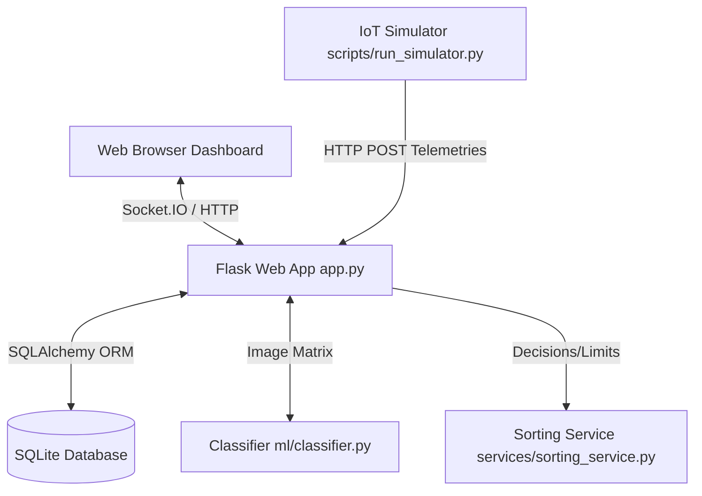
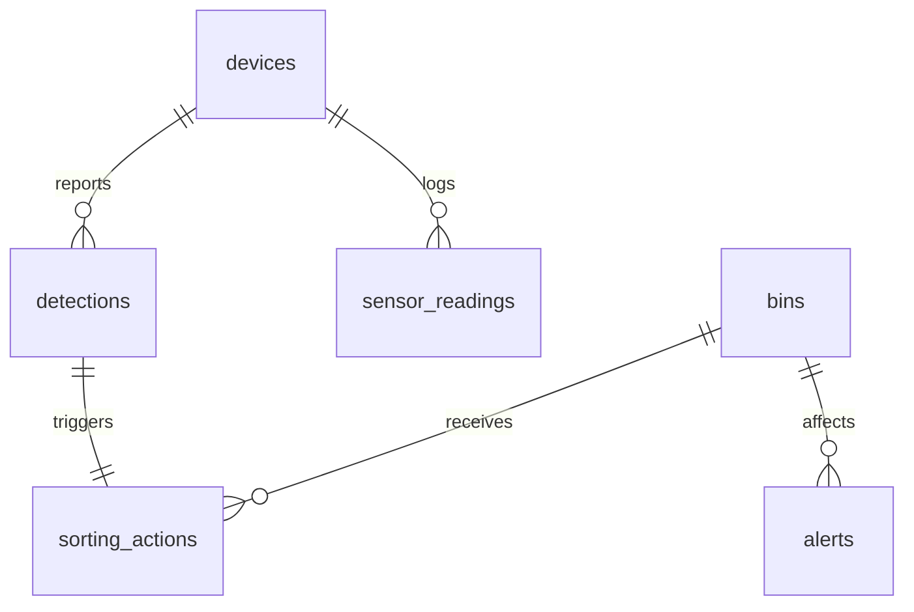

# System Architecture Documentation

This document describes the software design and system architecture for the **IoT-Enabled Automated Waste Segregation and Material Sorting System**.

## 1. Modular System Design
The system is constructed with a strict **Separation of Concerns (SoC)**, separating database entities, route-based controllers, business services, machine learning models, and IoT simulator components.



### Components
1. **Presentation Layer (Web Dashboard)**: HTML5, CSS3, Bootstrap 5, Chart.js, and Socket.IO client. Renders real-time camera views, telemetry indices, and charts.
2. **Controller Layer (Routes)**: Directs client endpoints to services.
   - `dashboard_routes.py`: Renders HTML pages, manages operator session variables.
   - `api_routes.py`: Exposes REST endpoints for devices, classifier uploads, telemetry streams, and dashboard actions.
3. **Service Layer (Business Logic)**:
   - `classification_service.py`: Exposes the classifier pipeline.
   - `sorting_service.py`: Computes bucket assignments, increments levels, flags confidence anomalies.
   - `analytics_service.py`: Generates KPI counters and compiles Chart.js arrays.
   - `alert_service.py`: Registers alerts and emits SocketIO toast events.
   - `device_service.py`: Processes heartbeat events, tracks connection drops.
   - `realtime_service.py`: Handles global SocketIO room emissions.
4. **Data Access Layer (Models)**: SQLite database mapped via SQLAlchemy ORM.
5. **Computer Vision & ML Pipeline**: Preprocesses camera frames, extracts visual features, and performs inference.
6. **Telemetry Generator & Protocol**: Formats and transmits sensor outputs.

---

## 2. Machine Learning Inference Pipeline
The classification pipeline ensures deterministic and real-time execution:

```
[Camera Image]
      │
      ▼
[File Validation]  ──► Allowed Extensions (.png, .jpg, .jpeg, .webp), Max size limit (16MB)
      │
      ▼
[Image Preprocessing] ──► Resize to 64x64, Grayscale & RGB Conversion, Pixel Normalization
      │
      ▼
[Feature Extraction]  ──► Color Means (RGB/HSV), Edge Density (Canny), Texture Gradient Magnitude (Sobel)
      │
      ▼
[Model Inference]  ──► Random Forest Classifier (pkl) ──► Predicts Category & Confidence Probability
      │
      ▼
[Sorting Rules]    ──► Checks Confidence Threshold (e.g. 70%) ──► Route or Flag Diverted
```

---

## 3. Database Schema Layout
The relational schema links telemetries and categorizations:



- **devices**: Stores registration settings, online/offline state, and last seen heartbeats.
- **detections**: Records each item classified, mapping confidence, model version, and conveyor image paths.
- **sorting_actions**: Details the physical diverter decision (SORTED, FLAGGED, DIVERTED, FAILED) for audits.
- **bins**: Retains fill percentage volumes (0.0 to 10.0 m³) and warning flags.
- **sensor_readings**: Historical log of load-cell weight, moisture, and temperature telemetries.
- **alerts**: Unread system error triggers.
- **users**: Operator admin password hashes.
